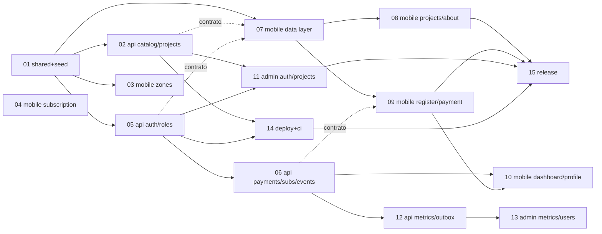

# Roadmap One Impact -- de Home completo a producto entregable

> Fecha: 2026-08-22 (sabado, tarde). Entrega Fase 1: **lunes 24 ago 2026, 18:00**.
> Estado de partida: monorepo verificado, tooling Claude, `apps/mobile` con
> fundacion + Inicio completo (`03bf7dd..48c6788`). API solo con `health`;
> admin con rutas placeholder; `packages/shared` con enums, planes, zod de auth
> y pago simulado.

Cada item tiene su spec en `specs/NN-<slug>.md` (numerado por orden de
ejecucion). El spec es la entrada de `/gen-plan <ruta del spec>`; el plan
resultante va a `.claude/plans/` y se ejecuta con `/run-plan-*`.

## Items

| #   | Item                              | Track        | Depende de                           | Fase                          | Estimado |
| --- | --------------------------------- | ------------ | ------------------------------------ | ----------------------------- | -------- |
| 01  | shared-contract-and-seed          | shared + api | --                                   | 1                             | 1.5 h    |
| 02  | api-catalog-and-projects          | api          | 01                                   | 1                             | 2 h      |
| 03  | mobile-zones-screens              | mobile       | 01 (tipos)                           | 1                             | 2.5 h    |
| 04  | mobile-subscription-screen        | mobile       | -- (shared ya tiene planes)          | 1                             | 2 h      |
| 05  | api-auth-and-roles                | api          | 01                                   | 1                             | 2.5 h    |
| 06  | api-payments-subscriptions-events | api          | 05                                   | 1                             | 3 h      |
| 07  | mobile-data-layer-and-auth        | mobile       | 01, contrato de 02/05 (MSW mientras) | 1                             | 2.5 h    |
| 08  | mobile-projects-and-about         | mobile       | 07                                   | 1                             | 2.5 h    |
| 09  | mobile-register-payment-welcome   | mobile       | 07, contrato de 06 (MSW mientras)    | 1                             | 3 h      |
| 10  | mobile-dashboard-and-profile      | mobile       | 06, 09                               | 1 (si hay tiempo) / 2         | 2.5 h    |
| 11  | admin-auth-and-projects           | admin        | 02, 05                               | 1 (minimo: login + tabla) / 2 | 3 h      |
| 12  | api-dashboard-metrics-and-outbox  | api          | 06                                   | 2                             | 3 h      |
| 13  | admin-metrics-users-subscriptions | admin        | 12                                   | 2                             | 3 h      |
| 14  | deploy-and-ci                     | infra        | 02, 05 (API desplegable)             | 1 (API+admin)                 | 2 h      |
| 15  | release-readme-gif                | docs         | todo lo de Fase 1                    | 1                             | 2 h      |

Total Fase 1 estricto (01-09, 11 minimo, 14, 15): ~27 h de trabajo asistido.
No cabe en serie antes del lunes: **el paralelismo no es opcional**.

## Grafo de dependencias



Las flechas punteadas son **dependencias de contrato, no de codigo**: mobile
puede avanzar contra MSW con el seed compartido mientras la API no existe,
siempre que ambos implementen el contrato REST del vault
(`arquitectura-sistema.md`). Esto es lo que habilita el paralelismo.

## Olas de ejecucion (que corre en paralelo y cuando)

Regla de paralelismo: **una lane = un worktree = un track** (`/run-plan-worktree`).
Dos lanes solo corren a la vez si sus write-scopes son disjuntos. Reglas duras:

- `packages/shared` y `apps/api/prisma/schema.prisma` se tocan en **una sola
  lane a la vez** (por eso 01 va solo y primero).
- Dos lanes de mobile a la vez solo si tocan features/rutas distintas (03 y 04
  cumplen: `features/zones` + `app/(tabs)/zones.tsx`, `app/zone/` vs
  `features/subscription` + `app/(tabs)/subscription.tsx`).
- Postgres local es uno: si dos lanes de api necesitan migrar, se serializan.
- Integracion: `/merge-plan` de cada lane a `main` **en el orden de la tabla**
  dentro de la ola; la siguiente ola arranca desde `main` actualizado.

| Ola | Cuando                       | Lanes en paralelo                                                                                          | Gate de salida                                                                   |
| --- | ---------------------------- | ---------------------------------------------------------------------------------------------------------- | -------------------------------------------------------------------------------- |
| 0   | Sab 22, ya                   | 01 (solo)                                                                                                  | seed + tipos en `main`; `quality-check --scope shared,api` verde                 |
| 1   | Sab 22 noche                 | **02** (api) + **03** (mobile zones) + **04** (mobile subscription)                                        | 3 merges; app publica completa salvo projects/about; `GET /plans                 | zones | projects` reales |
| 2   | Dom 23 manana                | **05** (api auth) + **07** (mobile data layer, contra MSW)                                                 | auth real; mobile consume API o MSW por flag                                     |
| 3   | Dom 23 mediodia              | **06** (api payments/subs/events) + **08** (mobile projects/about) + **11** (admin login + tabla projects) | flujo de negocio completo en API; app publica 100 %                              |
| 4   | Dom 23 tarde                 | **09** (mobile register/payment/welcome, contra MSW y luego API) + **14** (deploy API/admin)               | registro -> pago simulado -> bienvenida funcionando; API en Supabase + DO/Render |
| 5   | Dom 23 noche (si hay tiempo) | **10** (mobile dashboard/profile) + **12** (api metrics/outbox)                                            | zona logueada                                                                    |
| 6   | Lun 24 manana                | **15** (release) -- secuencial, sin lanes                                                                  | GIF, README, ai-workflow, push, correo antes de 18:00                            |
| 7   | Fase 2 (semana 25-31)        | 12 (si no entro) + 13                                                                                      | admin completo                                                                   |

### Corte de seguridad (domingo 20:00)

Si a esa hora 06 o 09 no estan verdes: se entrega la app publica completa
(olas 0-3) + registro/pago/dashboard **contra MSW** (funciona visualmente
identico) + API con auth y catalogo desplegada + admin con login y tabla. Se
documenta en README como "siguiente paso". **Lo publico nunca se sacrifica.**

### Asignacion sugerida por sesion de Claude Code

Con dos sesiones abiertas en paralelo (terminales distintas), cada una con su
worktree:

- Sesion A (track api/infra): 01 -> 02 -> 05 -> 06 -> 14 -> 12
- Sesion B (track mobile/admin): (espera 01) 03 -> 04 -> 07 -> 08 -> 09 -> 11 -> 10
- Ambas convergen en 15.

## Como ejecutar un item

```
/gen-plan .claude/roadmap/specs/NN-<slug>.md      # genera .claude/plans/YYYYMMDD-<slug>.plan.md
/run-plan-worktree <slug>                          # o /run-plan-guided si se quiere mirar cada fase
/merge-plan <slug>                                 # verify + review + merge --no-ff a main
/ai-log <slug>
```

Al cerrar un item, marcarlo en la tabla de estado de abajo.

## Estado

| #   | Item                              | Estado    | Rama / commits                                                 |
| --- | --------------------------------- | --------- | -------------------------------------------------------------- |
| 00  | mobile-foundation-and-home        | hecho     | `03bf7dd..48c6788` en main                                     |
| 01  | shared-contract-and-seed          | hecho     | `9dd3061..104e58c` en main                                     |
| 02  | api-catalog-and-projects          | hecho     | `378cd25..0d8ac58`, mergeado a main en `fc142c9`               |
| 03  | mobile-zones-screens              | hecho     | `f458a55..ec6f416`, mergeado a main en `d01d14b`               |
| 04  | mobile-subscription-screen        | hecho     | `bdc84ae..11443dc`, mergeado a main en `4817435`               |
| 05  | api-auth-and-roles                | hecho     | `d408426..80e57ad`, mergeado a main en `07f5d04`               |
| 06  | api-payments-subscriptions-events | hecho     | `6a24006..0573655`, mergeado a main en `d0fab7b`               |
| 07  | mobile-data-layer-and-auth        | hecho     | `8d7c0d1..570cdf5` (merge parcial `2e45527` + cierre en main)  |
| 08  | mobile-projects-and-about         | hecho     | `c3aa9bf..122c7d0` en `feat/mobile-projects-and-about`          |
| 09  | mobile-register-payment-welcome   | hecho     | `9ad0ea4..6bf5002` en `feat/mobile-register-payment-welcome`   |
| 10  | mobile-dashboard-and-profile      | pendiente |                                                                |
| 11  | admin-auth-and-projects           | hecho     | `6d83c96..ce681d5` en `feat/admin-auth-and-projects`, sin mergear |
| 12  | api-dashboard-metrics-and-outbox  | pendiente |                                                                |
| 13  | admin-metrics-users-subscriptions | pendiente |                                                                |
| 14  | deploy-and-ci                     | pendiente |                                                                |
| 15  | release-readme-gif                | pendiente |                                                                |

**Sobre el 07**: se entrego en dos tandas. El merge `2e45527` trajo solo las
fases 1 (alinear `api-client`) y 2 (cliente, query keys, token-store y hooks);
las cuatro restantes entraron despues, directo en `main`: `fdb8d72` (MSW sobre
el seed compartido), `81016a1` (`AuthProvider`, guards y grupos de rutas),
`7ccdcef` (Zonas consumiendo hooks) y `570cdf5` (cierre y AI log). Los items 08 y
09 se replanificaron sobre esta base: sus criterios de aceptacion redactados
sobre MSW y sesion **ya se pueden cumplir literalmente**.

**Sobre el 11**: las 6 fases del plan
`.claude/plans/20260823-admin-auth-and-projects.plan.md` estan ejecutadas en el
worktree de `feat/admin-auth-and-projects` (login con cookie httpOnly, guarda de
rol, tabla de proyectos con filtros por zona y estado, alta/edicion, publicacion
de avances y Playwright). Desviaciones respecto del plan escrito, todas
verificadas: `middleware.ts` esta deprecado en Next 16, asi que la guarda vive en
`apps/admin/src/proxy.ts` con export `proxy`, corre en Node.js (no Edge) y el
route handler BFF se llama `/api/gateway` para no colisionar con ese nombre; los
primitivos de UI son propios (D3b, `docs/adr/002-admin-ui-primitives.md`);
`packages/shared` **no** se toco. `apps/admin` e2e da 5/5 verde en local, contra
`next dev` y contra `next start`. El job `admin-e2e` de CI queda `SIN CONFIRMAR`
hasta que haya un push con run verde en GitHub. Detalle de todas las
desviaciones en el anexo del plan y en `docs/local-run-status.md`.
